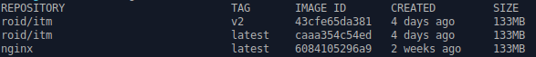

# Introducción a Docker


### 1. ¿Qué es un contenedor?

Un conteneodr es un proceso en la computadora *host* el cual se encuentra aislado de el resto de los procesos. El aislamiento se logra utilizando los *namespace* y *cgroups* a nivel kernel.

Los contenedores se comportan similiar a una máquina virtual, pero sin ser una como tal.Un contenedor se basa de una imagen la cual proporciona el sistema de archivos el cual proporciona las dependencias necesarias para su funcionamiento como: archivos de configuración, scripts, entre otros.

### 2. Descargando Imagenes

Docker es similar a vagrant ya que cuenta con un repositorio similar a *github* llamado Ducker Hub (https://hub.docker.com/) en Docker hub es posible encontrar imagenes oficiales de las diferentes distribuciones de GNU/Linux como Ubuntu, CentOS entre otros.

Al igual que *git* Docker proporciona un comando para descargar de los repositorios una imagen base para crear un contenedor.

Ejemplo:

 ```bash
 docker pull ubuntu
 ```
**Nota:**  Es necesario crear una cuenta en Docker hub y autenticarse con el comando `docker login`


### 3. Visualizando Imagenes 

Para visualizar las imagenes disponibles es posible pasar el parámetro `images` al comando `docker` para visuzaliar las imagenes que se encuentran disponibles en el servidor o *host*:


 ```bash
 docker images
 ```
Ejemplo de salida del comando:



Como se puede visualizar en la imagen anterior existen tres imágenes, dos basadas de la imagen *roid/itm* (versión 2 y latest) y una imagen del repositorio *nginx*.

Una imagen base puede tener diferentes versiones permitiendo crear diferentes versiones de la aplicación a hospedar. Un ejemplo se puede crear una imagen basada en PHP versión 5.6 y otra basada en PHP versión 7.2.


### 4. Eliminando Imagenes

Las imagenes se alamacenan comúnmente en del directorio `/var/lib/docker/overlay2` en ocasiones es necesario liberar espacio eliminando las imagenes descargadas del repositorio en Internet. Docker proporciona el comando `docker rmi` (Remove Image) el cual permite borrar del *host* la imagen base disponible.


 ```bash
 docker rmi <image id>
 ```