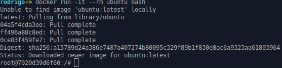
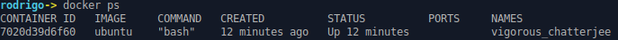

# Creando contenedor

A continuación, se muestra como generar un contenedor basado de la imagen de Ubuntu.

### 1. Creando un contenedor

Los contenedores se basan de una imagen para su creación gracias a esta caracteristica es posible crear múltiples contenedores en cuestión de segundos a diferencia de una máquina virtual la cual puede llevar de varios minutos en estar lista para su funcionamiento.

Para crear el contenedor ejecutamos el siguiente comando:


```bash
 docker run -it --rm ubuntu bash
 ```

Descripción:

- `docker run`: Indica que se desea iniciar un contenedor.
- `-it` : Estos parámetros indican que se trabajará de manera interactiva (`i`) y se tendrá acceso a la TTY del contenedor (`t`).
- `--rm`: Indica que cuando se detenga el contenedor este será eliminado.
- `ubuntu`: Indica la imagen que se utilizará para crear el contenedor.
- `bash`:  El último parámetro proporciona el comando que se desea ejecutar dentro el contenedor.

Ejemplo de salida:

**Nota**: para salir del contenedor es necesario ejecutar el comando `exit`.



El *prompt* (`root@7020d39d6f60:/#`) indica que nos encontramos dentro el contenedor la imagen de Ubuntu proporciona la gran mayoría de los comandos disponibles en dicha distribución.


### 2. Verificando contenedores en ejecución

Uno de los beneficios de utilizar contenedores es la capacidad de generar múltiples contenedores basada de la misma o diferente imagen.
Para visualizar que contenedores están en ejecución es posible utilizar el comando `docker ps`:




Parámetros de salida

- `CONTAINER ID`: Identificador único del contenedor
- `IMAGE` : Imagen base utilizada para la creación del contenedor.
- `COMMAND`: Comando proporcionado a ejecutar en el contenedor.
- `CREATED`: Tiempo transcurrido desde la creación del contenedor.
- `STATUS`: Puerto(s) mapeados al contenedor.
- `NAME`: Nombre aleatorio generado de manera automática por Docker.


