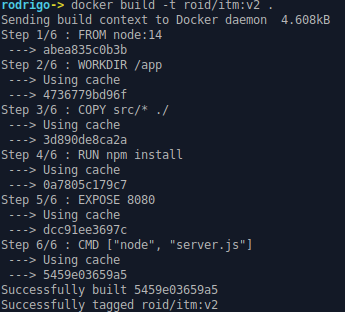
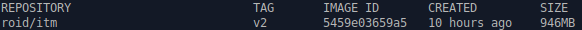
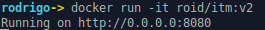
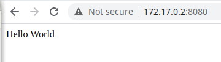
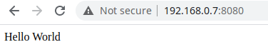

# Personalizando contenedores

Existe una amplia variedad de imágenes disponibles en los repositorios de Docker hub, pero en ocasiones estas imágenes no  con las características requeridas para la aplicación. Docker permite personalizar la imagen base y obtener como resultado una nueva imagen a la medida de la aplicación a publicar.


### 1. Usando Dockerfile

A continuación, crearemos un Dockerfile el cual permita crear una aplicación web basada en *node*: 

	FROM node
    WORKDIR /app
	COPY disc/* /app
	RUN npm install
    EXPOSE 8080
	CMD ["node", "server.js"]

Descripción de parámetros:

- `FROM` Imagen a utilizar para generar la nueva imagen.
- `WORKDIR` Establece como directorio de trabajo el directorio /app (similar a ejecutar `cd /app`)
- `COPY` Agregar los archivos del directorio actual al directorio /app dentro del contenedor.
- `RUN` Ejecuta el comando indicado.
- `EXPOSE` Indica que puertos estará en escucha el contenedor.
- `CMD` Especifica que comando ejecutará por omisión el contenedor.


### 2. Creando imagen

Para generar una nueva imagen Docker proporciona el comando `build` este comando permite generar una nueva imagen basada de otra y personalizar la nueva imagen utilizando el Dockerfile.

Ejemplo de sintaxis del comando `docker build`:

```
docker build -t <repositorio>/<nombre_contenedor>:<tag> <ubicación del Dockerfile>
```

Para crear una nueva imagen es necesario realizar los siguientes pasos:

1. Ubicarnos en el directorio donde se encuentra el arhivo *dockerfile*.
2. Dentro este directorio ejecutar el siguiente comando `docker build -t roid/itm:v2 .` Es importante mencionar que se desea generar una imagen para el repositorio *roid* con nombre *itm* y etiqueta *v2*.

	Ejemplo de salida:

	


Para verificar la creación de la nueva imagen utilizamos el comando `docker images` para visualizar las imágenes disponibles de manera local.



**Nota:** Para este ejemplo es importante ubicarnos en el directorio [Dockerfile](dockerfile/Dockerfile) el cual contiene una aplicación de *Node*.


### 3. Ejecutando contenedor

La ejecución de un contenedor se puede realizar de dos maneras la primera permite ejecutar el contenedor de manera interactiva es decir visualizar el *standard output* del contendor en pantalla. La segunda opción es ejecutar el contenedor en modo no atendido un *background*.

#### 3.1 Modo interactivo.

Para ejecutar un contenedor Docker cuenta con el comando `run` para poner en marcha el contenedor. Para ejecutar un contenedor basado de la imagen generada con anterioridad ejecutamos el siguiente comando:

		docker run -it roid/itm:v2

Ejemplo de comando:




#### 3.2 Modo no atendido

Para la ejecución en modo *background* utilizaremos el comando `run`, pero con la diferencia de en lugar de proporcionar los parámentros `-it` proporcionaremos el parámetro `-d`.

	docker run -d roid/itm:v2

**Nota:** Para verificar si el contenedor se esta ejecutando en *background* ejecutamos el comando `docker ps`
    
### 4. Verificando aplicación web

Aun cuando el contenedor se encuentra en ejecución solo es posible acceder al servicio web de manera local. Para acceder al servicio es necesario identificar la dirección IP que adquirió el contenedor. 

Lo anterior se puede lograr utilizando el comando:

```
docker inspect -f '{{range.NetworkSettings.Networks}}{{.IPAddress}}{{end}}' <id_del_contenedor>
``` 

Para verificar si el contenedor esta ejecutando la aplicación web abrimos nuestro navegador favorito ingresando la dirección IP y el puerto 8080 sobre la cual esta ejecutando nuestra aplicación.




**Nota:** El identificado del ID se puede obtener con el comando `docker ps`

### 5. Mapeo de puertos

En ocasiones es necesario permitir que los usuario visualicen de manera externa la aplicación web dentro el contenedor. Para permitir que una aplicación web que se encuentra dentro un contenedor esté disponible fuera del *host* que hospeda el contenedor es necesario proporcionar el parámetro `-p <host_port>:<container_port>` (parámetro puerto) al comando `run` para exponer los puertos del contenedor hacia el exterior.


Ejemplo:

	docker run -it -p 8080:8080 roid/itm:v2
    
Abrimos nuestro navegador ingresando la IP de nuestro dispositivo. A partir de este momento cualquier persona que tenga la dirección IP del *host* y el puerto que se mapeo la aplicación podrá  ser acceder a la aplicación web.


