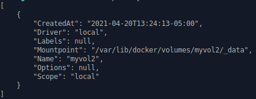

# Uso de *bind mounts*

Docker permite que los directorios y archivos en el *host* sea accesible dentro el contenedor. Los archivos o directorios deben ser referenciados de manera absoluta en el *host* para que se puedan montar de manera correcta en el contenedor. 


### 1. Utilizando *bind mount*

Al momento de ejecutar un contenedor es posible especificar que directorios del *host* estará disponible en el contenedor agregando el parámetro `--mount`. 

	--mount type=bind,source=<host_path>,target=<container_destination_path>

* `type` indica que se vinculará un directorio del *host* dentro el contenedor.
* `source` ruta absoluta del directorio o archivo que será accesible dentro el contenedor.
* `destionation` ruta absoluta del directorio o archivo donde se depositará dentro el contenedor.

Ejemplo:

Considere que se desea acceder el directorio `target` que se encuentra en el directorio de trabajo actual sea accesible dentro el contenedor en el directorio `/app`. Una manera de lograr esto es proporcionar en el atributo `source` el valor `$(pwd)/target` (`$(pwd)` indica de manera reducida el directorio de trabajo). En el atributo `target` es necesario

```
docker run -d \
  -it \
  --name devtest \
  --mount type=bind,source="$(pwd)"/target,target=/app \
  nginx:latest
```
**Nota:** El parámetro `--name` permite establecer el nombre del contenedor.

### 2. Trabajando con volúmenes

Los volúmenes es el mecanismo preferido para almacenar información de manera persistente en los contenedores de Docker. Bind depende de la estrucutra de directorios para trabajar, los volumenes en el *host* son completamente administrado por Docker.

Existen multiples comandos para administrar los volumenes en Docker, a continuación se muestran los más comunes:

*	`docker volume create <vol_name>`: Crear un nuevo volumen
*	`docker volume rm <vol_name>`: Eliminar volumen
*	`docker volume ls`: Listar volumenes disponibles
*	`docker volume inspect <vol_name>`: Ver información detallada del volumen

### 3. Asignando un volumen al contenedor

Para asignar un volumen se realiza con el comando mount sin el parámetro *type*, Ejemplo:

```
docker run -d \
  --name devtest \
  --mount source=myvol2,target=/app \
  nginx:latest
```

Para obtener la información referente a un volumen es posible utilizar el comando `docker volumen inspect` para desplegar información adicional referente al volumen.

Ejemplo:

	docker volume inspect myvol2

Resultado del comando:



Donde *myvol2* es el nombre del volumen existente en el *host*.