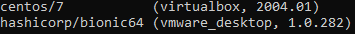

# Boxes #

*Box* son paquetes utilizados por Vagrant para generar máquinas virtuales basados en plantillas. Vagrant proporciona utilerías para descargar y administrar las plantillas disponibles en Internet.


### 1. Descargando *box*

El catalogo cuenta con la mayoría de los sistemas operativos base y aplicaciones como LAMP stacks, Ruby, Python, entre otros. La descarga de las plantillas del repositorio público se realiza mendiante el comando:
```bash
vagrant box add USER/BOX
```

Para descargar el *box* referente a Ubuntu bionic ejecutamos el comando:

```bash
vagrant box add ubuntu/bionic64
```

### 2. Visualizando plantillas (Box)

El comando `vagrant box list` permite visualizar los templetes disponibles en el sistema local, estos templetes (Box) 

Ejemplo de salida: 



### 3. Eliminar Box

Las plantillas descargas tienen la función de generar diferentes máquinas virtuales de mana necesidad del uso de Internet. En ocasiones ya no es necesario mantener la imagen o box para eliminar la platilla se puede utilizar el siguiente comando:

```bash
vagrant box remove <box name>
```