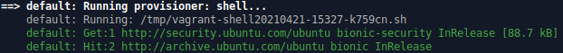

# Aprovisionamiento

Las máquinas virtuales (Box) es una plantilla de un sistema operativo en blanco es decir no hospeda ningún servicio o aplicación en la máquina virtual.

### 1. Instalación de paquetes

Una manera de instalar paquetes en la máquina virtual es accediendo vía el comando `vagrant ssh ` y posteriormente ejecutar los comandos para instalar los paquetes disponibles en el sistema operativo. 

Ejemplo:

La instalación de *apache* en el servidor se puede realizar ejecutando los siguientes comandos:

```bash
sudo su -                   # Cambiar a usuario root
apt-get update              # Actualizar los repositorios 
apt-get install -y apache2  # Instalar apache2
systemctl start apache2     # Iniciar el servicio de apache
```

El comando `systemctl` permite verificar el estado de los servicios instalados en la máquina virtual en este caso el servicio de *apache*:

```bash
systemctl status apache2
```
Salida del comando:
```bash
apache2.service - The Apache HTTP Server
   Loaded: loaded (/lib/systemd/system/apache2.service; enabled; vendor preset: enabled)
  Drop-In: /lib/systemd/system/apache2.service.d
           └─apache2-systemd.conf
   Active: active (running) since Tue 2021-03-23 02:51:48 UTC; 29min ago
 Main PID: 2207 (apache2)
    Tasks: 55 (limit: 1151)
   CGroup: /system.slice/apache2.service
           ├─2207 /usr/sbin/apache2 -k start
           ├─2208 /usr/sbin/apache2 -k start
           └─2209 /usr/sbin/apache2 -k start

Mar 23 02:51:48 ubuntu-bionic systemd[1]: Starting The Apache HTTP Server...
Mar 23 02:51:48 ubuntu-bionic apachectl[2185]: AH00558: apache2: Could not reliably determine the server's fully qualified domain name, using 127.0.1.
Mar 23 02:51:48 ubuntu-bionic systemd[1]: Started The Apache HTTP Server.

```

### 2. Validando el servicio web

La máquina virtual es un ambiente aíslado por tal motivo no es posible acceder desde fuera de la máquina virtual. Para validar el funcionamiento del apache es posible utilizar la herramienta `curl`, accediendo a la máquina virtual y posteriormente ejecutar los siguientes comandos:

```bash
curl localhost
```
Salida del comando:
```html
<!DOCTYPE html PUBLIC "-//W3C//DTD XHTML 1.0 Transitional//EN" "http://www.w3.org/TR/xhtml1/DTD/xhtml1-transitional.dtd">
<html xmlns="http://www.w3.org/1999/xhtml">
  <!--
    Modified from the Debian original for Ubuntu
    Last updated: 2016-11-16
    See: https://launchpad.net/bugs/1288690
  -->
  <head>
    <meta http-equiv="Content-Type" content="text/html; charset=UTF-8" />
    <title>Apache2 Ubuntu Default Page: It works</title>
    <style type="text/css" media="screen">
  * {
    margin: 0px 0px 0px 0px;
    padding: 0px 0px 0px 0px;
  }

  body, html {
    padding: 3px 3px 3px 3px;

    background-color: #D8DBE2;

    font-family: Verdana, sans-serif;
    font-size: 11pt;
    text-align: center;
  }

<salida recortada>
```

Como se puede observar regresa el contenido HTML de la página de bienvenida de apache.

### 3. Aprovisonando con *scripts*

Para automatiza el aprovisionamiento es posible utilizar *scripts* el cual permita instalar, configurar o cualquier acción requerida para aprovisionar nuestra aplicación:

#### 3.1 Generando *script*

Con nuestro editor de texto favorito creamos un archivo con el nombre de *bootstrap.sh* en el cual agregarmos la siguiente líneas:


```
apt-get update
apt-get install -y apache2
if ! [ -L /var/www ]; then
  rm -rf /var/www
  ln -fs /vagrant /var/www
fi
```
**Nota:** El archivo *bootstrap.sh* se debe encontrar en el mismo nivel que nuestro *Vagrantfile*.

### 3.2 Modificando *Vagrantfile*

En el archivo *Vagrantfile* en la sección de configuración agregamos la siguiente línea:

	config.vm.provision :shell, path: "bootstrap.sh"

La líena anterior indica que se ejectura un *script* en la consola de la máquina virtual.


### 3.3 Iniciando nuestro *Box*

Para aprovisonar la máquina virtual de manera automática es posible realizarlos ejecutando con el comando `vagrant up` su es la primera vez que se generá lamáquina virtual.

En dado caso la máquina virtual ya este en ejecución o sea una máquina virutal ya existente es posible forzar el aprovisionamiento utilizando el comando:

`vagrant reload --provision`

Ejemplo de salida del comando reload:




**Nota:** Cada vez que se modifique el archivo *bootstrap.sh* es necesario ejecutar el comando anterior.