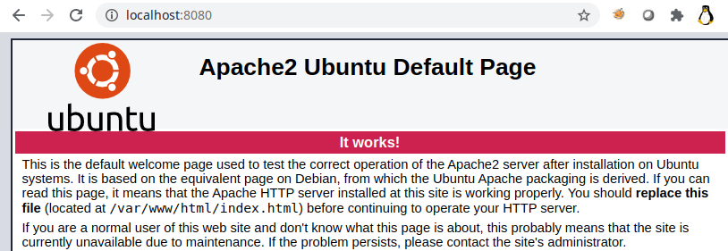
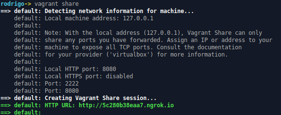
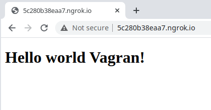

# Publicando servicios


### 1. Accediendo a los servicios de manera remota

Es posible realizar la publicación de los servicios utilizando la *IP* del *host*. Para realizar la publicación es necesario configurar un *forward* del puerto deseado del *host* a la máquina virtual.

Esto se pueda realizar agregando la siguietne línea al apartado de configuración de la máquina virtual:

```bash
config.vm.network "forwarded_port", guest: <guest_port>, host: <host_port>
```


Ejemplo:
```bash
config.vm.network "forwarded_port", guest: 80, host: 8080
```
En caso la PC donde se está ejecutando VirtualBox tiene asignada la dirección IP 192.168.1.X ya sea esta estática o dinámica es posible acceder al servicio de apache instalado previamente en la máquina virtual abriendo el navegador en la PC *host* y posteriormente teclear en la barra de direcciones  `http://<ip>:8080` o `http://localhost:8080`




### 2. Accediendo a los servicios desde Internet

Vagrant permite compartir nuestro ambiente vía Internet permitiendo publicar nuestro trabajo de manera fácil.  Para ralizar lo anterior es necesario utilizar el *plugin share* de Vagrant. El *plugin* de Vagrant utiliza la herramienta **ngrok** la cual tiene que estar previamente instalada. **Ngrok** es una herramienta utilizada por los desarrolladores web para compartir y publicar sus APIs de manera temporal para su evaluación. 

Posterior a la instalación de ngrok[^1] es posible instalar el *plugin* **vagrant-share** el cual conectara los puertos declarados en el Vagrantfile con *ngrok*.

La instalación del plugin se realizar con el siguiente comando:

```bash
$ vagrant plugin install vagrant-share
```

Posterior a la instalación del plugin utilizamos el comando `vagrant share` para publicar nuestra aplicación. Almomento de ejecutar el comando `vagrant share` Vangrant analizará el archivo `Vagrantfile` indentificando en que puerto se mapeo la aplicación y finalmente proporcionará una liga la cual puede ser utilizada desde cualquier navegador para acceder al servicio publicado:



Ejemplo de URL:



[^1]. Para más información consulte la liga: [ngrok](https://ngrok.com/download)